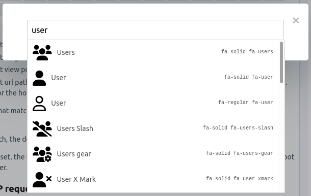

# Font Awesome for Redactor for Craft CMS

Integrate [font Awesome](https://fontawesome.com/) to your redactor.

This plugin supports Font Awesome version 5 and 6 only.

It supports local versions of Font Awesome, or online ones through [Kits](https://fontawesome.com/kits).

Free and Pro license supported.

[Animations](https://fontawesome.com/docs/web/style/animate) are supported in the sense that you can add extra css classes to the icons before inserting them.

## Installation

- `composer require ryssbowh/craft-redactor-fa-api`
- Add `fontawesome` to your redactor config file(s) (key `plugins`).

## Settings

You have two choices to load Font Awesome: through a kit, or local path

### Kit

Enter your kit url in the settings, it must be the full url.

### Path

You need 3 things for this to work:
- The path where font awesome can be found, that can be anywhere in your project.
- The version of fontawesome on your disk
- The license of font awesome on your disk

License and version are important to get right to make sure the api return the right results.

This is the default setup when installing this plugin, at the time of writing this plugin is shipped with fontawesome 6.1.1 free.

### Em tags

By default redactor will replace `i` tags with `em` tags, you can disable this in the settings.

## Usage

A new button will be created on the redactor toolbar, click on it, it open a popup with a search box that will search on the API.  
Clicking on an icon will insert it in your redactor content.



## Frontend

This plugin solely focuses on Control Panel, if you wished to register css files or kits on your frontend you could do something like this:

PHP
```
RedactorFa::$plugin->fa->registerFaFiles();
```
Twig
```

```

This will register either your kit or the local fontawesome depending on your settings.
